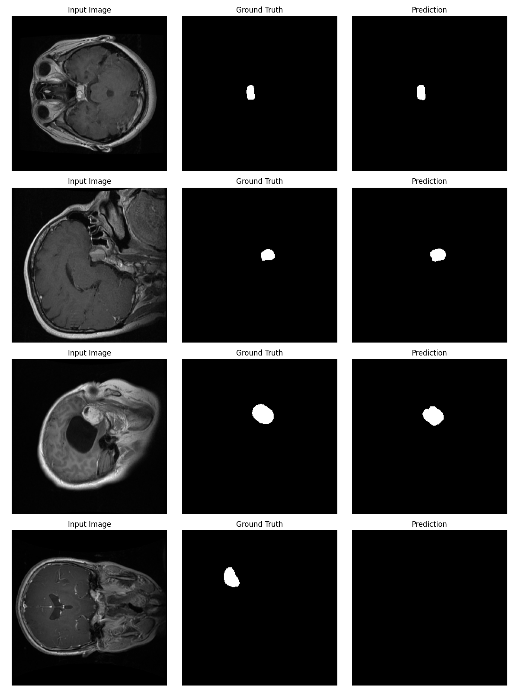

# Deep Learning-Based Brain Tumor Segmentation

This project implements **U-Net** and **Attention U-Net** models for **brain tumor segmentation from MRI images**.  
The goal is to automatically identify tumor regions using deep learning techniques and compare segmentation performance.

## 📌 Important

All source code and notebooks are located in the **master branch**.

👉 Click here to view the full implementation:  
https://github.com/farnazmnz/Collaborative-Design-Research-/tree/master

---

## 🧠 Models Implemented

- Vanilla U-Net  
- Attention U-Net  
- Dice + IoU evaluation  
- MRI preprocessing pipeline  

---

## 📂 Files (master branch)

- `Unet_tumor_detection.ipynb` — training notebook  
- `attention_unet.py` — attention U-Net model  
- `compare_models.py` — model comparison  
- `data_preprocessing.py` — preprocessing pipeline  
- `dataset_visualization.ipynb` — data visualization  
- `main.py` — training entry point  

---

## 📊 Dataset

Dataset link:  
https://www.kaggle.com/datasets/ashkhagan/figshare-brain-tumor-dataset

The dataset contains **3064 MRI brain images** including:

- Meningioma  
- Glioma  
- Pituitary tumors  

Images are resized, normalized, and used for segmentation training.

---

## 📈 Evaluation Metrics

- Dice Score  
- Intersection over Union (IoU)

## 🖼️ Sample Results

### U-Net Predictions

### Attention U-Net Predictions

